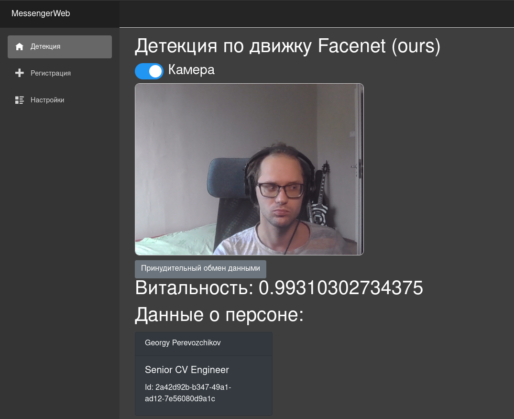

# mipt-networks-2022
Final project for the networks MIPT course

## Face API

API for interaction and control with face recognition engines. This project created with Fast API, Docker, PostgreSQL DB and Krakend API Gateway.

Web UI created using .Net 6 and Web Assebly. 



## Install

1. Clone this repository
2. Configure:
    - `cp .database.example.env .database.env`
    - `cp app/.log-config.example.ini app/.log-config.ini`
    - `cp app/.env.example.yaml app/.env.yaml`
    - `cp jwk/symmetric.example.json jwk/symmetric.json`
    - `cp krakend/config.example.json krakend/config.json`
    - for each proider in `app/providers`:
        - `cp app/providers/$provider/.config.example.yaml app/providers/$provider/.config.yaml`
3. Build and run:
    ```bash
    $ docker compose up -d
    ```

## Usage

- http://0.0.0.0:5000/docs/v1 - dev endpoint (without jwt)
- http://0.0.0.0:8080/docs/v1 - prod endpoint
- http://0.0.0.0:8091/__stats - metrics
- http://0.0.0.0:80/ - web ui
